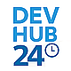

  
  
    Bitrix24 Developer Tools Hub
  

Welcome to the central hub for Bitrix24 developer tools. This repository offers a curated collection of official SDKs, UI kits, examples, and application templates to streamline your development process with the Bitrix24 platform.

## 📚 Table of Contents

- [SDKs and Libraries](#sdks-and-libraries)
  - [PHP SDK](#php-sdk)
  - [JavaScript/Node.js SDK](#javascript-sdk)
- [UI Tools](#ui-tools)
  - [Bitrix24 UI Kit](#bitrix24-ui-kit)
  - [Design Tokens](#design-tokens)
  - [Icons](#design-icons)
- [Usage Examples](#usage-examples)
- [Application Templates](#application-templates)
- [Documentation](#documentation)

## SDKs and Libraries

### PHP SDK

- **b24phpsdk**: The official PHP library for interacting with the Bitrix24 REST API. It supports both OAuth tokens and incoming webhooks, with features like automatic token renewal and offline queues.

  [GitHub Repository](https://github.com/bitrix24/b24phpsdk). Find more details in the [documentation](https://apidocs.bitrix24.com/api-reference/b24phpsdk/index.html)

### JavaScript/Node.js SDK

- **b24jssdk**: The official JavaScript SDK for Bitrix24 REST API, compatible with both browser and Node.js environments. It supports modern JavaScript features and offers advantages over the traditional BX24.JS library.

  [GitHub Repository](https://github.com/bitrix24/b24jssdk). Find more details in the [documentation](https://bitrix24.github.io/b24jssdk/)

## UI Tools

### Bitrix24 UI Kit

- **b24ui**: A UI kit for developing web applications using the Bitrix24 REST API, built on NUXT & VUE. It provides a set of reusable components to accelerate development.

  [GitHub Repository](https://github.com/bitrix24/b24ui). Find more details in the [documentation](https://bitrix24.github.io/b24ui/)

### Design Tokens

- **b24style**: Design tokens for Bitrix24 UI Kit. Provides the ability to create application interfaces that closely match the Bitrix24 user interface using Tailwind CSS utility classes. 

  [GitHub Repository](https://github.com/bitrix24/b24style). Find more details in the [documentation](https://bitrix24.github.io/b24ui/)

### Icons

- **b24icons**: The library contains SVG icons for use in the interfaces of both local and mass-market applications for Bitrix24.

  [GitHub Repository](https://github.com/bitrix24/b24icons). Find more details in the [documentation](https://bitrix24.github.io/b24icons/)

## Usage Examples

- **b24sdk-examples**: A collection of examples demonstrating the usage of various Bitrix24 SDKs and tools in real-world scenarios.

  [GitHub Repository](https://github.com/bitrix24/b24sdk-examples). Find more details in the [documentation](https://bitrix24.github.io/b24ui/)

## Application Templates

- Ready-to-use application templates that can be deployed quickly using Docker. These templates provide a foundation for building custom business logic on top of Bitrix24.

  It's a private repo yet, so be tuned!

## Documentation

- **b24restdocs**: The official repository for Bitrix24 REST API documentation, offering comprehensive guides and references for developers.

  [GitHub Repository](https://github.com/bitrix24/b24restdocs). Read [online version](https://apidocs.bitrix24.com/)

## Additional Resources

- **crest**: CRest is a minimalistic PHP library for calling Bitrix24 REST methods via webhooks and OAuth 2.0.

  [GitHub Repository](https://github.com/bitrix-tools/crest)

---

This hub aims to simplify navigation through Bitrix24's development tools, enabling you to build robust integrations and applications efficiently.
